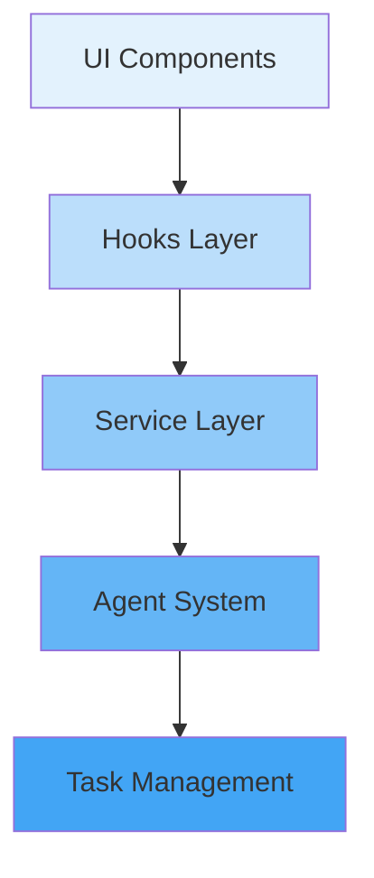

# Critical Development Insights
*December 30, 2024*

## Key Success Patterns

1. **Agent-Task Architecture**
   - Separation of agent logic from task management proved effective
   - Real-time updates driven by task state changes
   - Clear responsibility boundaries between agents

2. **Mock-First Development**
   ```typescript
   // This pattern worked well:
   if (process.env.NODE_ENV === 'development') {
       return createMockWebSocket();
   } 
   ```
   - Enabled rapid UI development
   - Clear separation between mock and real implementations
   - Realistic data flow simulation

3. **Type-Driven Flow**
   ```typescript
   interface AgentTask {
     id: string;
     type: TaskType;
     priority: Priority;
     status: TaskStatus;
   }
   ```
   - Types guide implementation
   - Errors reveal design gaps
   - Natural documentation

## Critical Next Steps

1. **Assessment Engine Integration**
   - Start with type definitions
   - Use existing task system
   - Keep agent separation

2. **Data Layer**
   ```typescript
   class DataManager<T> {
       private store: Map<string, T>;
       private eventEmitter: EventEmitter;
       // ... rest of implementation
   }
   ```
   - Follow established patterns
   - Keep real-time focus
   - Maintain type safety

3. **Document Generation**
   - Template system
   - PDF generation
   - Storage strategy

## Architecture Pattern to Maintain


Remember: The system's strength comes from its clear boundaries and type-driven development. Keep this pattern as we expand.