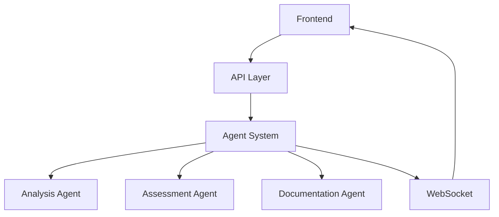

# Delilah Agentic - Development Status
*Last Updated: December 29, 2024*

## Core Systems

### 1. Agent Infrastructure
- Base agent framework ✓
- Real-time analysis system ✓
- WebSocket integration ✓
- Message protocol defined ✓

### 2. Assessment Implementation
- Core assessment types defined ✓
  - Basic IHA
  - IHA with Form 1
  - IHA for CAT
  - IHA/SIT for CAT
- Form sections completed ✓
  - Demographics
  - ADL/IADL
  - Clinical
  - Environmental
  - Documentation
  - Recommendations

### 3. Dashboard
- Real-time metrics ✓
- Trend visualization ✓
- Insight generation ✓
- WebSocket updates ✓

## Component Status

### Frontend
✅ Complete:
- Assessment form structure
- Type definitions
- Core components
- Dashboard UI
- Real-time updates

🔄 In Progress:
- Form validation
- State management
- Data persistence
- File handling

### Backend
✅ Complete:
- Agent framework
- Message protocol
- WebSocket setup
- Base metrics

🔄 In Progress:
- API endpoints
- Database models
- File storage
- Authentication

## Next Steps

### Immediate Priorities
1. Complete assessment validation
2. Implement data persistence
3. Add file upload/handling
4. Connect frontend/backend

### Short Term Goals
1. Authentication system
2. Report generation
3. User management
4. Advanced analytics

## Architecture Overview

## Development Guide
See [CONTRIBUTING.md](./CONTRIBUTING.md) for workflow and standards.
See [TROUBLESHOOTING.md](./TROUBLESHOOTING.md) for common issues.
