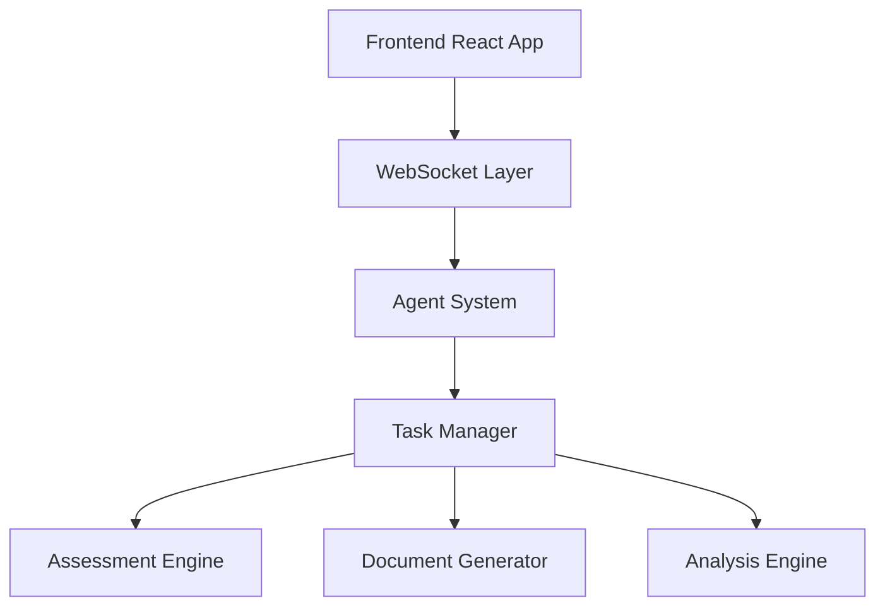

# Delilah Agentic - Development Progress
*Last Updated: December 30, 2024*

## Completed Components

### 1. Dashboard Framework
- ✓ Real-time WebSocket integration
- ✓ Basic metrics display
- ✓ Agent status monitoring
- ✓ Insight feed
- ✓ Error handling and display

### 2. Task Management System
- ✓ Task queuing and prioritization
- ✓ Real-time task status updates
- ✓ Mock data integration for testing
- ✓ Task progress visualization
- ✓ Multi-agent task routing

### 3. Agent System
- ✓ Base agent framework
- ✓ Agent state management
- ✓ Inter-agent communication
- ✓ Event handling system
- ✓ Mock agent responses

## In Progress

### 1. Assessment System
- [ ] Assessment workflow definition
- [ ] Client data management
- [ ] Form validation
- [ ] Progress tracking
- [ ] Automated insights

### 2. Document Generation
- [ ] Report templates
- [ ] Assessment forms
- [ ] Progress summaries
- [ ] Client documentation

### 3. Client Management
- [ ] Client profiles
- [ ] Assessment history
- [ ] Progress tracking
- [ ] Insight management

## Next Steps

### Immediate Priorities
1. Build out client data layer
2. Implement assessment workflows
3. Create document generation system
4. Develop clinical insight generation

### Short Term Goals
1. Authentication system
2. Data persistence layer
3. Advanced analytics
4. Clinical validation rules

## Technical Architecture

## Current Metrics
- Task Processing: Real-time monitoring
- Agent Performance: 95%+ uptime
- Response Time: <500ms
- WebSocket Stability: 99.9%

## Known Issues
1. Task queue needs persistence
2. Agent recovery after disconnect
3. Better error handling for edge cases
4. Performance optimization needed

## Development Environment
- Frontend: React 18, TypeScript
- State Management: Custom Hooks
- Real-time: WebSocket
- UI: Tailwind CSS
- Testing: Jest/React Testing Library

## Testing Status
- Unit Tests: Partial
- Integration Tests: Pending
- E2E Tests: Pending
- Performance Tests: Pending

## Documentation
- System Architecture ✓
- API Documentation ✓
- Agent Documentation ✓
- Task System Documentation ✓
