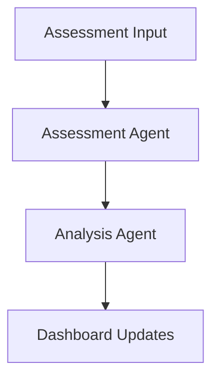

# Developer Narrative: Where We Are & Where We're Going

## The Journey So Far

We started building Delilah Agentic as a system to modernize Occupational Therapy assessments and reporting. Our approach has been methodical, building each component with a focus on real-world OT workflows.

### Key Milestone: Assessment Processing
Our first major piece was establishing how to handle real OT assessments. We started with a real in-home assessment report (you can find this example in `docs/examples/IHA_Form_1.docx`). This showed us exactly what data we're dealing with and how OTs actually work.

From this, we built:
1. A comprehensive assessment data model (`backend/models/assessment.py`)
2. The Assessment Agent to process these reports
3. Initial dashboard visualization

### Current Focus: Analysis Layer
We've just completed the Analysis Agent's core structure. This agent takes processed assessments and:
- Generates insights
- Calculates risk scores
- Determines priorities
- Makes recommendations

## Where We Are Now

Right now, we have a working pipeline from assessment intake through analysis:



The dashboard is displaying real-time updates, and our agents are communicating properly. We've implemented thorough testing for both agents.

### Latest Implementation
The most recent work focused on the Analysis Agent. We deliberately kept the implementation high-level, with clear hooks for adding more specific OT domain logic later. The core structure is there, but the complex assessment rules still need to be added.

## Immediate Next Steps

1. Documentation Agent Implementation
This is the natural next piece - taking analyzed assessments and generating proper reports. We have the data structure ready; now we need to:
- Create report templates
- Build content generation logic
- Implement PDF generation
- Add version control for reports

2. Coordinator Enhancement
The coordinator needs to be enhanced to manage the full workflow:
```python
Assessment -> Analysis -> Documentation -> Delivery
```

3. Domain Logic Implementation
We've built the framework - now it needs the specific OT knowledge:
- Assessment scoring rules
- Risk factor patterns
- Intervention recommendations
- Outcome predictions

## Current Challenges

1. Report Generation
We need to decide how to structure the Documentation Agent to handle:
- Multiple report formats
- Custom templates
- Version control
- PDF generation

2. Domain Logic Integration
The Analysis Agent is ready for more specific rules about:
- Risk scoring weights
- Priority determination
- Recommendation generation

3. Workflow Management
The coordinator needs to handle:
- Multiple concurrent assessments
- Different assessment types
- Error recovery
- State persistence

## Development Environment

The system is currently running with:
- Python 3.12 backend
- React frontend with Tailwind
- PostgreSQL database
- WebSocket for real-time updates

Key commands:
```bash
# Start backend
python -m uvicorn main:app --reload

# Start frontend
cd frontend && npm start

# Run tests
pytest  # Backend tests
cd frontend && npm test  # Frontend tests
```

## Code Organization

```
/agents
  ├── base.py           # Base agent framework
  ├── assessment_agent.py
  └── analysis_agent.py
/backend
  ├── models/           # Data models
  └── metrics/          # Dashboard metrics
/frontend
  ├── src/components/   # React components
  └── src/hooks/        # Custom hooks
```

## Next Development Session

When you start your next session:

1. Review the recently implemented Analysis Agent (`agents/analysis_agent.py`)
2. Look at the tests (`tests/agents/test_analysis_agent.py`) to understand the behavior
3. Start with either:
   - Documentation Agent implementation
   - Coordinator enhancement
   - Domain logic implementation

The most pressing need is the Documentation Agent, as it completes our core workflow. The foundation for this is in the Analysis Agent's output structure.

## Tips for Moving Forward

1. Check the real assessment example first (`docs/examples/IHA_Form_1.docx`)
2. Keep the high-level structure, add domain logic later
3. Follow the established test patterns
4. Update dashboard metrics for new components

## Questions to Consider

1. How should report templates be structured?
2. What format should the Documentation Agent use for output?
3. How should we handle report versioning?
4. What domain-specific rules should be prioritized?

## Getting Help

- Architecture questions: See `docs/architecture/`
- Data models: Review `backend/models/`
- Workflow questions: Check `docs/CURRENT_STATE.md`
- Test patterns: Look at existing tests in `tests/`

## Final Notes

We've built a solid foundation with clear separation of concerns. The next major piece (Documentation Agent) should follow the same patterns we've established in the Assessment and Analysis agents.

Remember: we're keeping the implementation high-level first, with hooks for domain-specific logic to be added later. This has worked well so far and helps keep the code maintainable.

Your first commit will likely be the Documentation Agent skeleton, following the pattern in `agents/analysis_agent.py`.