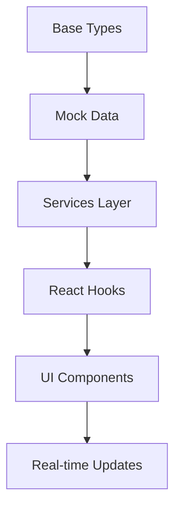
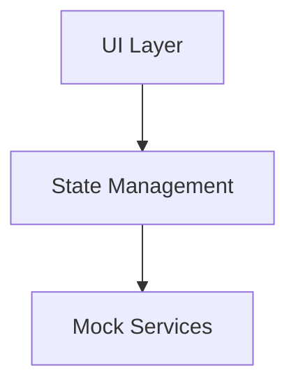
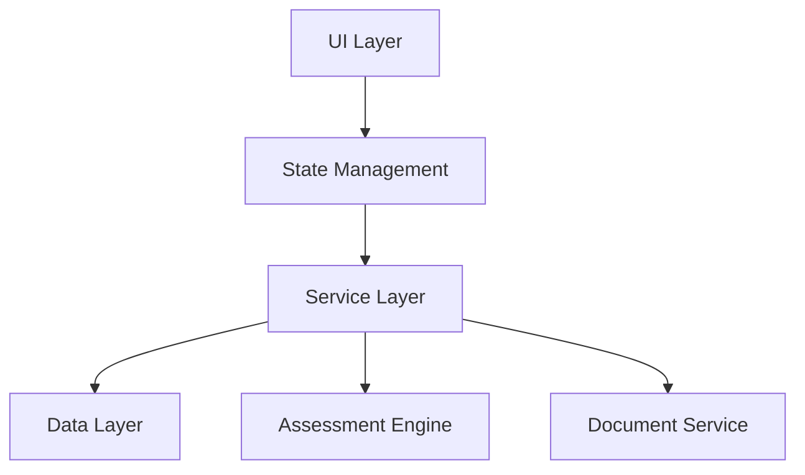

# Development Narrative & Strategy
*Session: December 30, 2024*

## Key Insights from Current Session

### 1. Successful Patterns
- **Incremental Development**: Started with core task management before UI
- **Mock-First Approach**: Using mock data enabled rapid UI development
- **Visual Feedback**: Early implementation of real-time updates proved valuable
- **Type-Driven Development**: TypeScript errors guided our implementation

### 2. Development Flow


### 3. Current Strengths
- Strong type system
- Real-time capabilities
- Task management foundation
- Clean component architecture
- Scalable state management

## Immediate Opportunities

### 1. Assessment Engine Integration
```typescript
interface AssessmentFlow {
    stages: {
        id: string;
        type: 'form' | 'analysis' | 'review';
        status: 'pending' | 'active' | 'completed';
        assignedAgent?: AgentType;
        data: any;
    }[];
    currentStage: number;
    validations: ValidationRule[];
}
```

### 2. Client Data Layer
```typescript
interface ClientState {
    profile: ClientProfile;
    assessments: Assessment[];
    insights: AgentInsight[];
    documents: ClientDocument[];
    timeline: TimelineEvent[];
}
```

## Strategic Next Steps

### High Priority
1. **Data Persistence**
   - Implement client data storage
   - Add assessment history
   - Enable task queue persistence

2. **Assessment Workflow**
   - Define stage progression
   - Add validation rules
   - Implement agent assignment

3. **Document Generation**
   - Create report templates
   - Add PDF generation
   - Implement document storage

### Technical Debt
1. Error handling in WebSocket reconnection
2. Task queue cleanup mechanisms
3. Agent recovery procedures
4. Type system optimization

## Architecture Evolution

### Current


### Proposed Next


## Development Principles

1. **Keep Mock-First Approach**
   - Enables rapid UI iteration
   - Facilitates testing
   - Allows parallel development

2. **Maintain Type Safety**
   - Continue strong typing
   - Use TypeScript features
   - Document type decisions

3. **Progressive Enhancement**
   - Start with core functionality
   - Add features incrementally
   - Keep testing in sync

## Key Decisions Made
1. Using SVG for branding
2. Task-centric architecture
3. Real-time first approach
4. Modular agent system

## Recommended Next Session Focus
1. Begin assessment workflow
2. Implement client data store
3. Add document generation
4. Enhance error handling

## Technical Prerequisites for Next Phase
1. Database integration
2. PDF generation library
3. File storage solution
4. Authentication system

## Questions to Address
1. Assessment workflow complexity
2. Client data security requirements
3. Document template system
4. Real-time requirements for assessments

This narrative should provide a clear path forward while maintaining the successful patterns established in our current development session.