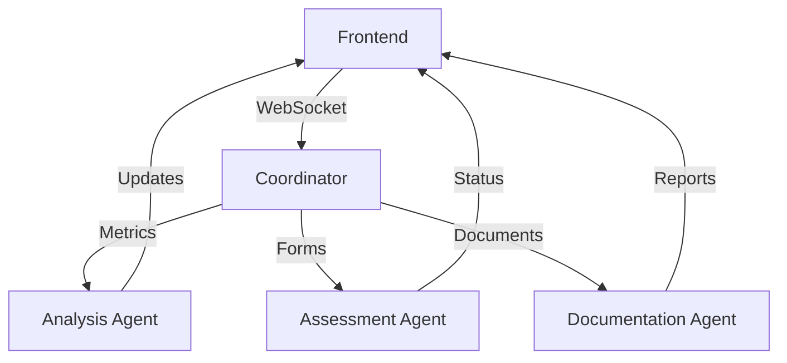

# Agent System Architecture

## Current Implementation (December 2024)

### Agent Components

1. Analysis Agent
- Dashboard metrics generation
- Trend analysis
- Real-time insights
- Status: Active ✓

2. Assessment Agent
- Form validation
- Assessment processing
- Type management
- Status: In Progress 🔄

3. Documentation Agent
- Report generation
- File management
- Template system
- Status: Planned 📋

### Data Flow


### Integration Points

1. Dashboard
```typescript
interface DashboardMetrics {
    activeClients: number;
    pendingAssessments: number;
    scheduledHours: number;
    reportsCount: number;
}

interface InsightMessage {
    type: 'risk' | 'action' | 'info';
    priority: 'high' | 'medium' | 'low';
    message: string;
    timestamp: string;
}
```

2. Assessment System
```typescript
interface AssessmentMessage {
    type: AssessmentType;
    action: 'create' | 'update' | 'validate';
    data: AssessmentFormData;
    metadata: {
        userId: string;
        timestamp: string;
    };
}
```

### Message Protocol
```typescript
interface AgentMessage {
    id: string;
    type: 'COMMAND' | 'QUERY' | 'RESPONSE' | 'EVENT';
    source: {
        type: string;
        id: string;
    };
    target: {
        type: string;
        id: string;
    };
    payload: any;
    timestamp: string;
}
```

## Active Features

### Analysis Agent
- Real-time metric calculation
- Trend detection
- Risk assessment
- Workload analysis

### Assessment Agent
- Form validation
- IHA assessment processing
- CAT designation support
- Form 1 calculations

### WebSocket Integration
- Real-time updates
- Bi-directional communication
- Auto-reconnection
- State synchronization

## Development Status

### Completed
- Base agent framework
- WebSocket infrastructure
- Message protocol
- Basic metrics

### In Progress
- Assessment validation
- Documentation system
- File handling
- Analytics engine

### Planned
- Advanced analysis
- ML integration
- Automated reporting
- Workflow optimization

## Usage Examples

### Metric Updates
```typescript
// Frontend subscription
socket.on('metrics', (data: DashboardMetrics) => {
    updateDashboard(data);
});

// Agent emission
await agent.emit('metrics', {
    activeClients: 24,
    pendingAssessments: 8,
    scheduledHours: 32,
    reportsCount: 5
});
```

### Assessment Processing
```typescript
// Submit assessment
const response = await socket.emit('assessment', {
    type: 'create',
    data: assessmentData
});

// Agent processing
async processAssessment(data: AssessmentFormData) {
    const validated = await this.validate(data);
    if (validated) {
        return this.save(data);
    }
}
```

## Configuration
```typescript
const config = {
    agents: {
        analysis: {
            updateInterval: 5000,
            batchSize: 100
        },
        assessment: {
            validationTimeout: 3000,
            maxRetries: 3
        },
        documentation: {
            templatePath: '/templates',
            outputPath: '/reports'
        }
    },
    websocket: {
        reconnectInterval: 5000,
        maxAttempts: 5
    }
};
```

## Error Handling
```typescript
class AgentError extends Error {
    constructor(
        message: string,
        public code: string,
        public retryable: boolean = false
    ) {
        super(message);
    }
}

// Usage
try {
    await agent.process(message);
} catch (error) {
    if (error.retryable) {
        await retry(process, message);
    } else {
        handleError(error);
    }
}
```

## Future Enhancements

### Short Term
1. Enhanced validation
2. File processing
3. Better error handling
4. Performance optimization

### Long Term
1. ML model integration
2. Advanced analytics
3. Automated workflows
4. Real-time collaboration
