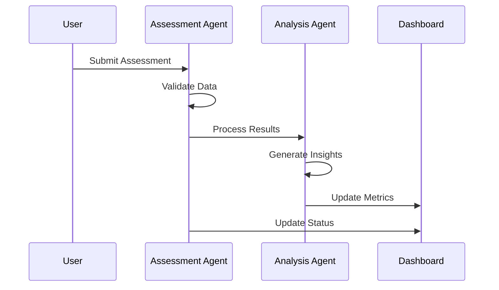

# Agent System Architecture

## Overview

The Delilah Agentic system uses a modular agent-based architecture where each agent is responsible for a specific domain of functionality. Agents communicate through a message-based system and are coordinated by a central coordinator.

## Core Components

### 1. Base Agent
All agents inherit from BaseAgent which provides:
- State management
- Session handling
- Message queuing
- Error handling

```python
class BaseAgent:
    def __init__(self, agent_type: AgentType, name: str)
    async def start_session(self, context: AgentContext) -> UUID
    async def end_session(self, session_id: UUID) -> None
    def update_status(self, status: AgentStatus) -> None
    async def handle_error(self, error: Exception, context: AgentContext) -> None
```

### 2. Assessment Agent
Handles processing of OT assessments:
- Validates assessment data
- Processes functional changes
- Generates initial metrics
- Updates dashboard

### 3. Analysis Agent
Processes assessment results to generate insights:
- Risk scoring
- Priority determination
- Recommendation generation
- Trend analysis

### 4. Documentation Agent (Pending)
Will handle report generation:
- Template management
- Content generation
- PDF creation
- Version control

## Data Flow



## Communication

### Message Format
```json
{
    "type": "message_type",
    "sender": "agent_id",
    "receiver": "agent_id",
    "data": {},
    "timestamp": "iso_timestamp"
}
```

### Message Types
- `assessment_completed`
- `analysis_completed`
- `metric_update`
- `error_occurred`

## State Management

### Agent States
- `IDLE`
- `BUSY`
- `ERROR`
- `DISABLED`

### Session Context
```python
@dataclass
class AgentContext:
    session_id: UUID
    user_id: Optional[UUID]
    metadata: Dict[str, Any]
```

## Error Handling

1. Local Error Handling
```python
try:
    # Agent operations
except Exception as e:
    await self.handle_error(e, context)
```

2. Error Recovery
- Session cleanup
- State reset
- Error logging
- Metric updates

## Implementation Guidelines

### 1. Adding New Agents
1. Inherit from BaseAgent
2. Implement required methods
3. Add message handling
4. Update coordinator

Example:
```python
class NewAgent(BaseAgent):
    def __init__(self, name: str):
        super().__init__(AgentType.NEW, name)
        
    async def process(self, data: Dict[str, Any]) -> Dict[str, Any]:
        # Implementation
```

### 2. Message Handling
1. Define message structure
2. Add to message queue
3. Implement handler
4. Update tests

### 3. State Changes
1. Use update_status method
2. Handle transitions
3. Update metrics
4. Log changes

## Testing

### Unit Tests
- Agent lifecycle
- Message handling
- Error cases
- State transitions

### Integration Tests
- Agent communication
- Workflow completion
- Error recovery
- Metric updates

## Future Enhancements

### 1. Performance
- Message batching
- Parallel processing
- Caching layer

### 2. Monitoring
- Agent health checks
- Performance metrics
- Error tracking
- Usage statistics

### 3. Scalability
- Agent pooling
- Load balancing
- State distribution

## Security Considerations

### 1. Authentication
- Agent verification
- Message signing
- Session validation

### 2. Authorization
- Role-based access
- Operation limits
- Resource control

### 3. Audit
- Operation logging
- State changes
- Error tracking
- Access records

## Development Workflow

### 1. New Features
1. Design message flow
2. Update data models
3. Implement agent logic
4. Add tests
5. Update documentation

### 2. Changes
1. Review message impact
2. Update affected agents
3. Test interactions
4. Update metrics

### 3. Deployment
1. Version check
2. State compatibility
3. Migration plan
4. Rollback strategy