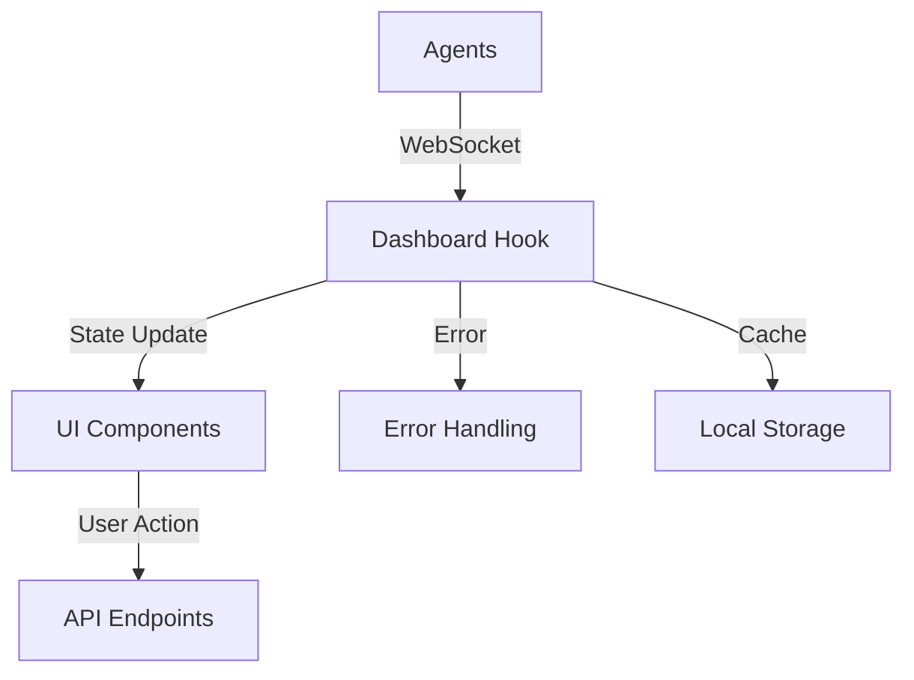

# Dashboard Architecture

## Overview

The dashboard provides real-time monitoring and visualization of system metrics, assessments, and insights. It uses WebSocket connections for live updates and React for the UI.

## Components

### 1. Data Hook
```typescript
const useDashboardData = () => {
  // Real-time data management
  // WebSocket handling
  // State updates
  // Error handling
}
```

### 2. Metric Cards
- Active Clients
- Pending Assessments
- Scheduled Hours
- Reports Due

### 3. Visualization Components
- Assessment Trends
- Risk Analysis
- Workload Distribution

### 4. Insights Panel
- Risk Factors
- Recommendations
- Action Items

## Data Flow



## Implementation Details

### 1. WebSocket Connection
```typescript
const ws = new WebSocket(`${process.env.WS_URL}/dashboard`);
ws.onmessage = (event) => {
    const message = JSON.parse(event.data);
    // Handle different message types
};
```

### 2. Metric Updates
```typescript
interface MetricUpdate {
    type: string;
    value: number;
    metadata?: object;
    timestamp: string;
}
```

### 3. State Management
- Real-time updates
- Historical data
- Error states
- Loading states

## Component Architecture

### 1. Layout
```tsx
<Dashboard>
    <MetricCards />
    <TrendsChart />
    <InsightsPanel />
    <ActionItems />
</Dashboard>
```

### 2. Data Management
```typescript
interface DashboardState {
    metrics: MetricData;
    trends: TrendData;
    insights: InsightData;
    status: Status;
}
```

### 3. Error Handling
```typescript
interface ErrorState {
    type: ErrorType;
    message: string;
    timestamp: string;
    retryCount: number;
}
```

## Development Guidelines

### 1. Adding Metrics
1. Update data models
2. Add to WebSocket handler
3. Create visualization
4. Update tests

### 2. New Components
1. Create component
2. Add to layout
3. Connect data
4. Style with Tailwind
5. Add tests

### 3. Error Handling
1. Define error types
2. Add error states
3. Create error UI
4. Update tests

## Testing

### 1. Component Tests
```typescript
describe('Dashboard', () => {
    it('renders metrics', () => {});
    it('handles updates', () => {});
    it('shows errors', () => {});
});
```

### 2. Hook Tests
```typescript
describe('useDashboardData', () => {
    it('connects websocket', () => {});
    it('updates state', () => {});
    it('handles errors', () => {});
});
```

### 3. Integration Tests
- WebSocket connection
- Data flow
- Error scenarios
- User interactions

## Performance Considerations

### 1. Data Management
- Batch updates
- Data compression
- Local caching
- Pagination

### 2. Rendering
- Component memoization
- Virtual lists
- Lazy loading
- Code splitting

### 3. Network
- Reconnection logic
- Data throttling
- Error recovery
- Cache headers

## Future Enhancements

### 1. Features
- Advanced filtering
- Custom views
- Data export
- Notifications

### 2. Performance
- Worker threads
- Service worker
- IndexedDB cache
- Request batching

### 3. UX
- Dark mode
- Mobile views
- Accessibility
- Animations

## Security

### 1. Data
- Input validation
- Output sanitization
- XSS prevention
- CSRF protection

### 2. Communication
- Secure WebSocket
- Token handling
- Rate limiting
- Error masking

### 3. Storage
- Secure storage
- Data expiry
- Clear on logout
- Encryption

## Development Process

### 1. New Features
1. Design component
2. Update data models
3. Implement logic
4. Add styling
5. Write tests
6. Update docs

### 2. Bug Fixes
1. Reproduce issue
2. Add failing test
3. Fix problem
4. Verify fix
5. Update docs

### 3. Refactoring
1. Identify issues
2. Plan changes
3. Update tests
4. Make changes
5. Verify functionality