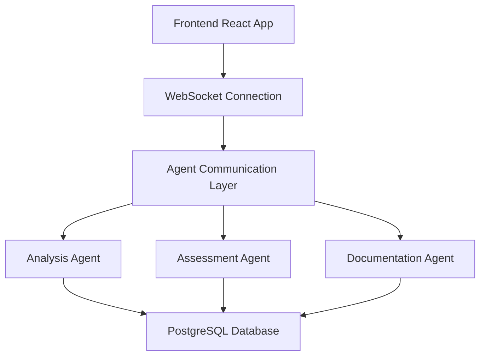
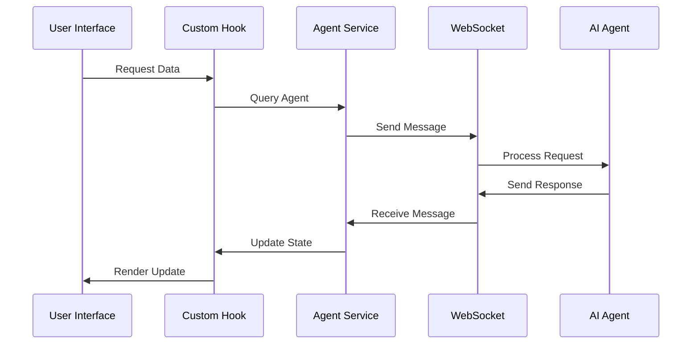

# Delilah Agentic System Architecture

## System Overview

### Purpose
Delilah Agentic is an AI-enhanced clinical management system designed to assist therapists and clinical practitioners in managing client relationships, assessments, and insights through intelligent automation and real-time analysis.

### Core Components



### Key Technologies
- Frontend: React 18, TypeScript, TailwindCSS
- Backend: Python FastAPI, PostgreSQL
- AI Agents: Custom Python-based agents
- Communication: WebSocket for real-time updates
- State Management: React Context + Custom Hooks
- Data Visualization: Recharts

## Technical Architecture

### Frontend Architecture
```
frontend/
├── src/
│   ├── components/      # React components
│   │   ├── common/     # Shared components
│   │   ├── dashboard/  # Dashboard-specific components
│   │   └── layout/     # Layout components
│   ├── hooks/          # Custom React hooks
│   ├── services/       # Service layer
│   ├── types/          # TypeScript definitions
│   └── utils/          # Utility functions
```

### Backend Architecture
```
backend/
├── api/                # API endpoints
├── agents/             # AI agent implementations
├── database/           # Database models and migrations
├── services/           # Business logic
└── utils/             # Utility functions
```

### Agent System
```
agents/
├── base.py            # Base agent class
├── analysis_agent.py  # Data analysis agent
├── assessment_agent.py # Assessment processing
└── documentation_agent.py # Documentation generation
```

## Data Flow

### Component Data Flow


### State Management
- React Context for global state
- Custom hooks for component state
- WebSocket for real-time updates
- Local storage for persistence

## Agent Communication

### Message Protocol
```typescript
interface AgentMessage {
  id: string;
  type: MessageType;
  source: AgentIdentifier;
  target: AgentIdentifier;
  payload: any;
  metadata: MessageMetadata;
}
```

### WebSocket Implementation
```typescript
class WebSocketManager {
  private ws: WebSocket;
  private reconnectAttempts: number = 0;

  connect() {
    this.ws = new WebSocket(WS_URL);
    this.setupListeners();
  }

  private setupListeners() {
    this.ws.onmessage = this.handleMessage;
    this.ws.onclose = this.handleClose;
    this.ws.onerror = this.handleError;
  }
}
```

## Data Models

### Client Data
```typescript
interface Client {
  id: string;
  name: string;
  status: ClientStatus;
  assessments: Assessment[];
  insights: ClientInsight[];
}
```

### Assessment Data
```typescript
interface Assessment {
  id: string;
  clientId: string;
  type: AssessmentType;
  status: AssessmentStatus;
  data: AssessmentData;
  analysis: AssessmentAnalysis;
}
```

## Security Architecture

### Authentication
- JWT-based authentication
- Token refresh mechanism
- Role-based access control

### Data Protection
- End-to-end encryption for sensitive data
- Data validation at service boundaries
- Input sanitization
- Audit logging

## Error Handling

### Frontend Error Handling
```typescript
try {
  await agentService.queryAgent('action', data);
} catch (error) {
  if (error instanceof NetworkError) {
    // Handle network errors
  } else if (error instanceof ValidationError) {
    // Handle validation errors
  }
}
```

### Error Recovery
1. Automatic retry with exponential backoff
2. Circuit breaker for failing operations
3. Fallback to cached data
4. Manual intervention triggers

## Performance Considerations

### Frontend Performance
- Component memoization
- Virtual scrolling for large lists
- Lazy loading of routes
- Image optimization

### Data Management
- Caching strategy
- Optimistic updates
- Batch processing
- Connection pooling

## Monitoring and Logging

### Key Metrics
1. Response times
2. Error rates
3. WebSocket connection status
4. Agent processing times

### Logging Strategy
```typescript
logger.info('Operation completed', {
  operation: 'queryAgent',
  duration: endTime - startTime,
  status: 'success'
});
```

## Development Workflow

### Local Development
```bash
# Start frontend
npm start

# Start backend
uvicorn main:app --reload

# Run tests
npm test
pytest
```

### Deployment Pipeline
1. Code review
2. Automated testing
3. Build process
4. Deployment verification

## Future Considerations

### Scalability
- Microservices architecture
- Load balancing
- Horizontal scaling
- Caching layers

### Features
- Mobile optimization
- Offline support
- Advanced analytics
- Integration capabilities

## References
- [Frontend Documentation](../frontend/README.md)
- [Backend Documentation](../backend/README.md)
- [API Documentation](../api/README.md)
- [Testing Guide](../testing/README.md)