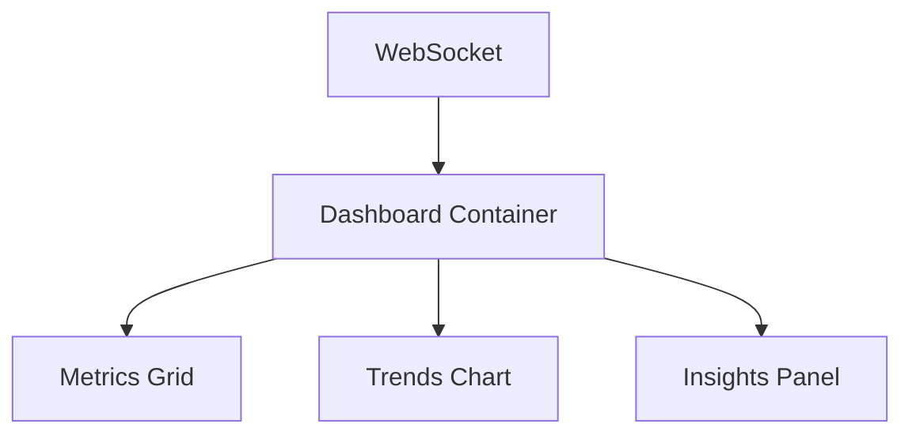

# Dashboard Implementation

## Current State (December 2024)

### Core Metrics
1. Active Clients: 24 (+12%)
2. Pending Assessments: 8 (-5%)
3. Scheduled Hours: 32 (+8%)
4. Reports Due: 5

### Components

1. MetricsDisplay
```typescript
interface MetricData {
    value: number;
    trend: number;
    label: string;
    icon: React.ReactNode;
}
```

2. TrendsChart
- Uses Recharts
- Shows:
  - Completed assessments
  - Pending assessments
  - Projected trends
- Time range: 3 months

3. InsightsPanel
```typescript
interface InsightData {
    message: string;
    priority: 'high' | 'medium' | 'low';
    timestamp: string;
}
```

### State Management
- Real-time WebSocket updates
- Local state with React hooks
- Caching for performance

### Data Flow


### Styling
- Tailwind CSS
- Responsive design
- Dark mode support
- Custom animations

### Performance
- Memoized components
- Optimized re-renders
- Lazy loading
- Error boundaries

### Error Handling
- Connection retry logic
- Fallback UI states
- Error notifications
- Data validation

### Future Enhancements
1. Customizable metrics
2. Advanced filtering
3. Export capabilities
4. More visualizations